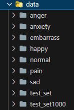

# Emotion Classification and Object Recognition (February 2024)

## Introduction
Welcome to our project!😄 
이 프로젝트는 감정 분류 및 객체 인식을 위해 컴퓨터 비전 모델, 특히 **ViT** 및 **ResNet** 의 성능을 활용하는 데 중점을 두었습니다. 또한 저희는 **Detection** 및 **Segmentation**, **Agumentation** 작업을 프레임워크에 통합하여 기능을 확장했습니다.
   

## 개발 환경
| **IDE**           | **GPU 서버**                    | **프로그래밍 언어** |
| ----------------- | ------------------------------- | ------------------- |
|  |        |               |

  

## 프로젝트 개요
**주제**
 
얼굴 인식 및 감정분류를 통한 음악 추천 AI
  

**선정배경**
 
on-device ai 기술이 발전하며 이젠 가볍게 모바일 기기에서 ai를 쉽게 접하고 사용할수 있게 됨에 따라 on-device ai를 기반으로 안면 이미지를 이용한 감정 분류 서비스를 기획하게 되었습니다.
  

**기획의도**
 
나의 하루와 그 날의 감정을 쉽고 간편하게 요약하여 기록하고 공유하는 서비스를 제공합니다.
  

**기존 유사 서비스와 무엇이 다를까? 차별화 전략은?**
 
- 대화형 ai가 하루를 요약한 일기를 나 대신 기록
- 안면 이미지 학습 및 감정 분류를 통한 음악 추천
  

**프로젝트 기간** 
 
2024.02.13 - 2024.02.29
  

✨ **6조 while(칭찬) 팀** ✨ 
 
`팀장` 임지혜
 
`팀원` 김정현, 박건수, 임정은(and 오세형)
  

### Key Features
- **감정 분류(ViT/ResNet)**: ViT와 ResNet을 활용한 우리 프로젝트는 이미지에 묘사된 감정을 정확하게 분류하는 데 탁월합니다. 특히 ResNet 아키텍처는 깊이와 효율성을 제공하여 다양한 감정을 정확하게 인식할 수 있습니다. 
- **Additional Tasks(etc)**:
    - **Detection**: 이미지 내에서 안면 인식을 하여 위치를 파악할 수 있도록 개체 탐지 기능을 통합하였습니다.
    - **Segmentation**: 이미지 내의 객체 경계를 구분한 분할 작업을 포함하였습니다.
    - **Agumentation**: 데이터 증강은 안면 부분을 크롭하거나 얼굴 방향(face pose)을 어규멘테이션하는 방식으로 진행하였습니다. 안면 부분 크롭을 통해 데이터의 다양성을 확보하고, face pose agumentation을 통해 모델이 다양한 얼굴 방향에 대응할 수 있도록 시도하였습니다.
 

## Dataset
[AI Hub::한국인 감정인식을 위한 복합 영상](https://www.aihub.or.kr/aihubdata/data/view.do?currMenu=115&topMenu=100&aihubDataSe=data&dataSetSn=82)
 
- 데이터셋 구성
  - 모든 이미지 데이터에 해당하는 메타데이터가 포함되어 있는 JSON 파일과 이미지 데이터는 1:N 관계로 매핑됩니다.
  - 이미지 데이터
    - 각 감정(기쁨, 당황, 분노, 불안, 상처, 슬픔, 중립)별 안면 사진
    - 총 데이터 수: 원천 데이터 50만 개 
      - Train 데이터 수: 1500, 3000, 5000, 10000 개 
      - Test 데이터 수: 1000 개 
  - JSON 파일
    - gender, age, faceExp_uploader, bg_uploader, faceBB_A, faceBB_B, faceBB_C(하위 어노테이션 포맷 참고)
 

**데이터셋 구조**
 

 
`파일명 형식` 게시자 ID 해시값 + "_" + 성별 + "_" + 연령 + "_" + 감정 + "_" + 배경 + "_" + 업로드 번호
 
`예시` 0cb3d5e25825f2908769e75f7f14dbc587423fcb6e5f50a0ff5a60078bb03df1_여_20_기쁨_숙박 및 거주공간_20210126165538-010-011.jpg
  

**어노테이션 포맷**(출처: 어노테이션 포맷 및 데이터 구조)
 

   

## EDA
제공된 데이터셋의 JSON 파일 내 라벨링과 안면 이미지에 대한 bounding box 처리가 완료되어 있습니다.
  

 
출처: [카이스트, 한국인 감정인식을 위한 복합 영상 데이터 , p.3.pdf](https://github.com/asummerz/est_wassup_6/files/14427389/04.pdf)
  

   

## Quick Start
**Clone the Repository**
~~~sh
git clone https://github.com/asummerz/est_wassup_6.git
~~~
 

**Install Dependencies**
~~~sh
pip install -r requirements.txt
~~~
위 명령어를 실행시키면 다음 라이브러리를 포함하여 필요한 패키지가 설치됩니다.
- transforms: 효율적인 이미지 변환을 위한 라이브러리
- Pillow: 이미지 처리 작업에 사용되는 Python Imaging 라이브러리
 
먄약 따로 설치가 필요하다면 아래 명령어를 사용하여 설치하세요.
 

~~~sh
pip install transforms
pip install pillow
~~~
 

**hyperparameters 변경**은 `modulize/config.py` 에서 할 수 있습니다.
  

✅ run `ResNet classification` with
~~~sh
python main.py --m ResNet
~~~
 

✅ run `Vision transformer classification` with
~~~sh
python main.py --m VitClassification
~~~
 

✅ run `ResNet detection` with
~~~sh
python main.py --m ResNetDetection
~~~
 

✅ run `Vision transformer classification` with
~~~sh
python main.py --m VitDetection 
~~~
 

Lyric crawling & Emotion classification 기능을 수행하는 Visualization Web Service를 구현하기 위해 [Streamlit](https://docs.streamlit.io/) API를 활용하였습니다. 
다음과 같은 명령어를 사용하여 Web Service를 실행해보세요.
 
✅ run `streamlit web` with
~~~sh
streamlit run app.py
~~~
  

## Web Demonstration Flow
1. 셀카 이미지 업로드

  

3. 오늘 일기 간단히 작성 > 노래 추천 > 추천 노래 듣기

  

4. Chrome browser를 통해 멜론 해당 음악 상세페이지에서 음악 듣기

   

## etc
**Detection**

  

**Face Crop**

  

**Face Pose Agumentation**

  

**Segmentation**

   

## App Sketch(비즈니스 실무 활용성)

  

   

## 발전가능성 및 확장성
1. 추가 데이터 수집 
  1-1. 나의 실제 감정과 AI가 판단한 나의 감정이 일치하는지 선택 
  1-2. 해당 감정에 추천된 노래를 타인에게도 추천할 것인지 선택 
     &nbsp;&nbsp; → 데이터를 추가로 획득하여 학습에 반영 가능 
2. 다른 어플과의 연동 
  2-1. 내가 구독하고 있는 음악 스트리밍 어플 또는 음악 서비스 기능을 제공하는 타 어플과 연동 
  2-2. AOS 또는 iOS 디바이스의 헬스케어 등 유용한 서비스가 확장 가능한 어플과의 연동 
    &nbsp;&nbsp; 2-2-1. ex: 삼성 헬스, 애플 건강 등
   

## License
while(칭찬)
